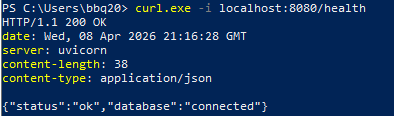
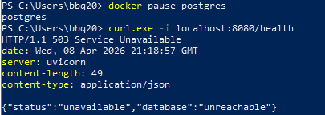
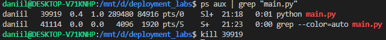
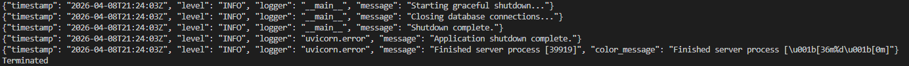

# Deployment of E-Commerce Apps

### Environment Variables

Create a `.env` file in the project root:
```bash
DB_HOST=localhost
DB_PORT=5432
DB_NAME=postgres
DB_USER=postgres
DB_PASSWORD=postgres
```

### Install & Run

```bash
pip install -r requirements.txt
python main.py
```

### Run Tests

```bash
pytest
```

## Health Check

### 200 OK - Database connected

```
curl -i localhost:8080/health
```



### 503 Service Unavailable - Database down

Stop or pause database (I did it via `docker pause postgres`) and repeat the request.



---

## Some logs

```json
{"timestamp": "2026-04-08T21:18:46Z", "level": "INFO", "logger": "__main__", "message": "Application startup complete."}
{"timestamp": "2026-04-08T21:18:46Z", "level": "INFO", "logger": "uvicorn.error", "message": "Application startup complete."}
{"timestamp": "2026-04-08T21:18:46Z", "level": "INFO", "logger": "uvicorn.error", "message": "Uvicorn running on http://0.0.0.0:8080 (Press CTRL+C to quit)", "color_message": "Uvicorn running on \u001b[1m%s://%s:%d\u001b[0m (Press CTRL+C to quit)"}
{"timestamp": "2026-04-08T21:19:07Z", "level": "INFO", "logger": "uvicorn.access", "message": "127.0.0.1:55872 - \"GET /health HTTP/1.1\" 503"}
```

## Graceful Shutdown

find process id and kill it:<br>


graceful shutdown logs:<br>

